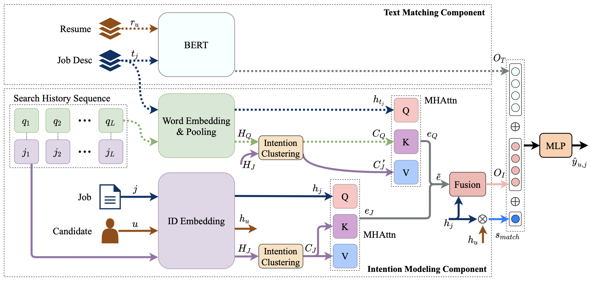

# SHPJF

Official PyTorch implementation for **S**earch **H**istory enhanced **P**erson-**J**ob **F**it model.

> *Yupeng Hou, Xingyu Pan, Wayne Xin Zhao, Shuqing Bian, Yang Song, Tao Zhang, Ji-Rong Wen.* **Leveraging Search History for Improving Person-Job Fit.** DASFAA 2022.

## Overview



## Requirements

```
python==3.7.7
pytorch==1.7.1
PyYAML==6.0
numpy==1.21.5
scikit_learn==1.0.2
```

## Quick Start

```bash
python preprocess.py
# After around 20 minutes' preprocessing
python main.py
```

## Datasets

*Our dataset will be released when it's applicable.*
After downloading and unzipping, these files should be moved to `dataset/`:

```
dataset/
├── data.{train/valid/test}           # <geek_id, job_id> pairs
├── data.{train/valid/test}.bert.npy  # BERT representation for <resume, job desc> pairs
├── data.search.{train/valid/test}    # search history
├── {geek/job}.token                  # geeks (or jobs) IDs
├── geek.low                          # whether a geek is labeled as a low-skilled candidate
├── job.search.token                  # job IDs exist only in search history
├── {geek/job}.longsent               # resumes or job descriptions
├── word.cnt                          # word frequency
└── word.search.id                    # words exist only in search history
```

> `geek` denotes candidates or job seekers.

## Acknowledgement

The main framework is reference to [RecBole](https://github.com/RUCAIBox/RecBole).

If you use this code for your research, please cite the following paper.

```
@inproceedings{hou2022shpjf,
  author = {Yupeng Hou and Xingyu Pan and Wayne Xin Zhao and Shuqing Bian and Yang Song and Tao Zhang and Ji-Rong Wen},
  title = {Leveraging Search History for Improving Person-Job Fit},
  booktitle = {{DASFAA}},
  year = {2022}
}
```
